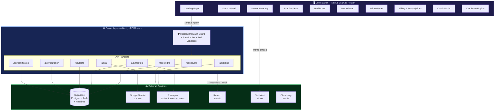
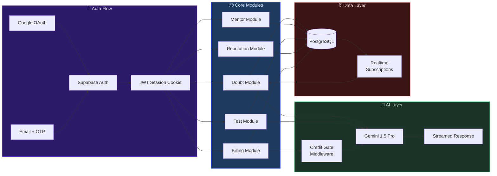
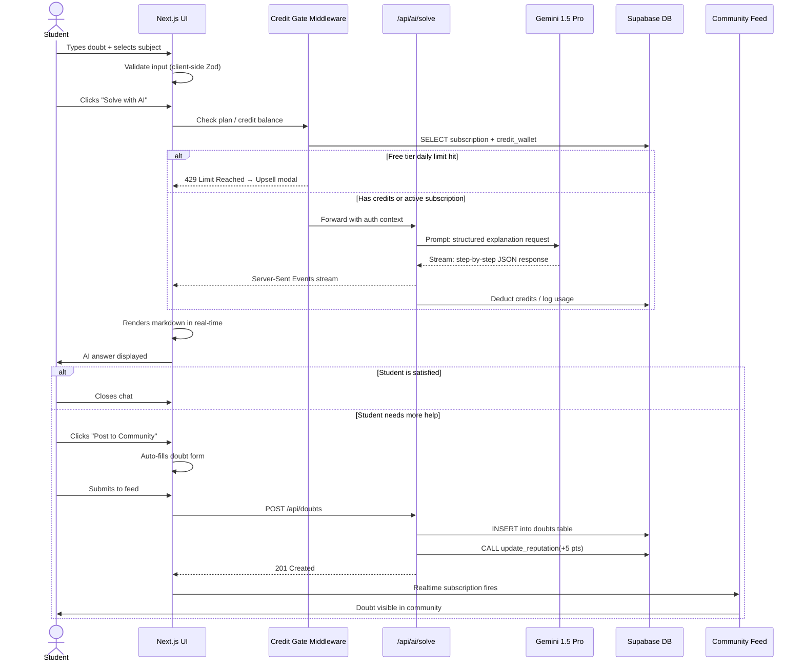
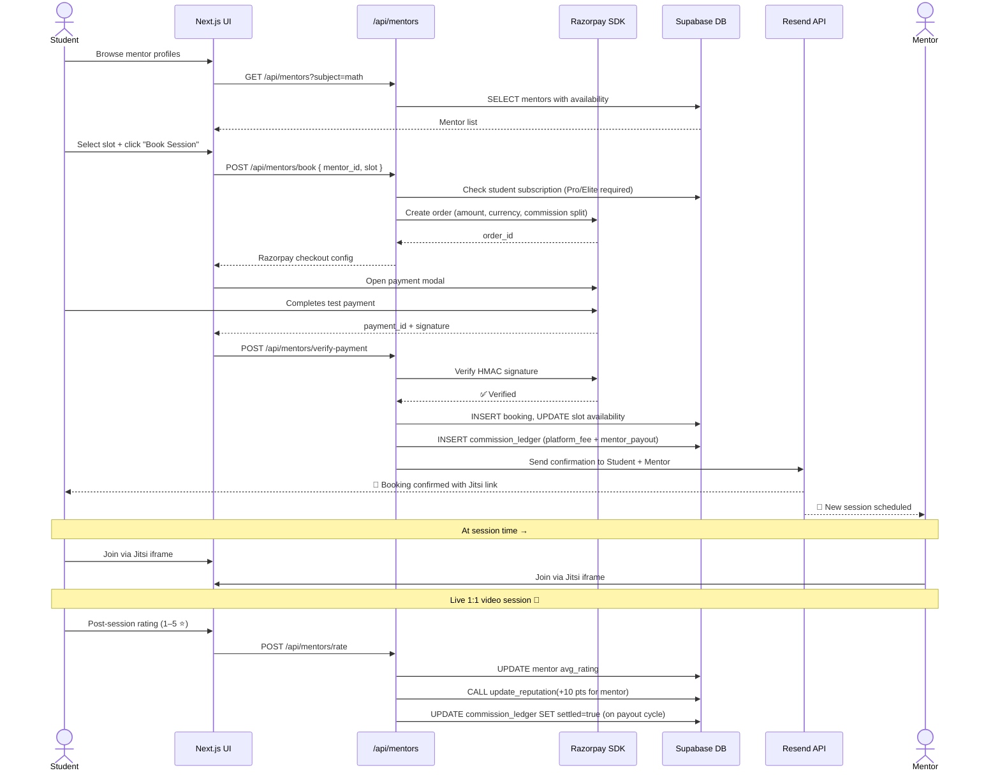
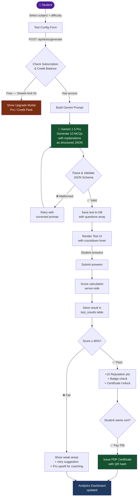
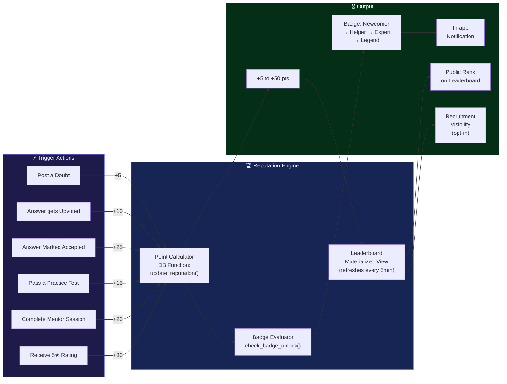
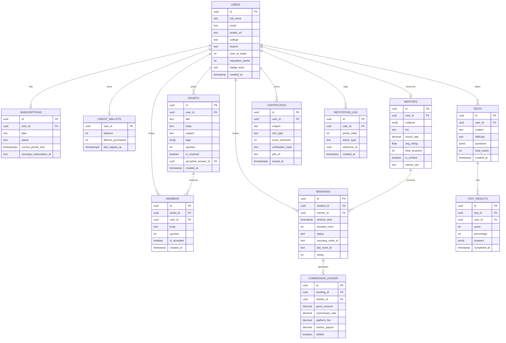
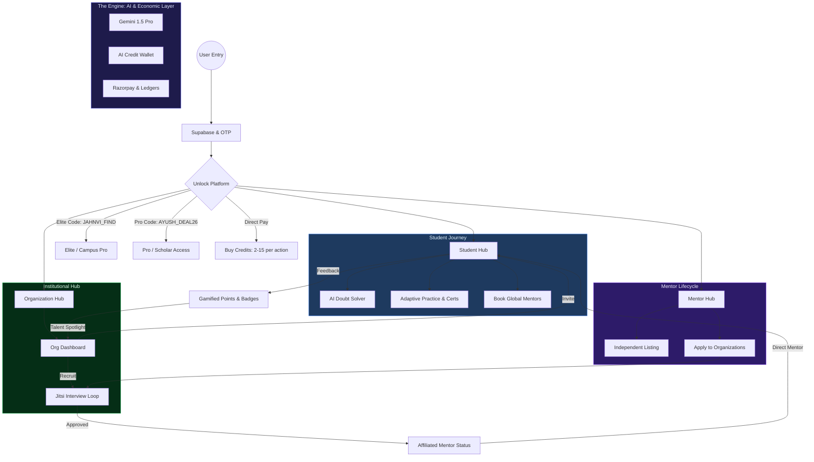
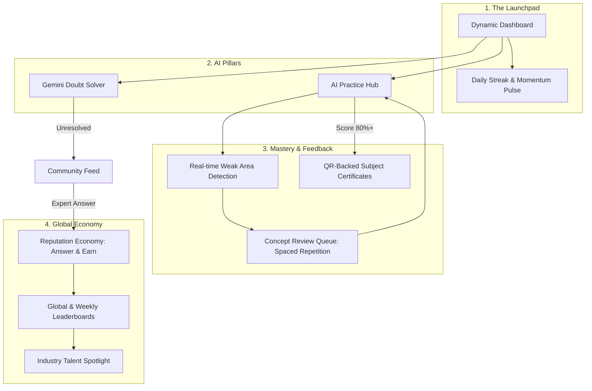

<!--
  SKILLBRIDGE — DEV_FUSION HACKATHON
  Problem Statement 2: Peer Learning & Doubt Resolution Platform
  Built by: Ayush Kumar Jha & Jahnvi Chauhan
  Deployed: Vercel | Backend: Supabase | AI: Google Gemini
-->

<div align="center">


<br/>

<a href="https://dev-fusion-dun.vercel.app/">
  
</a>

<br/><br/>

[](https://nextjs.org/)
[](https://www.typescriptlang.org/)
[](https://supabase.com/)
[](https://ai.google.dev/)
[](https://tailwindcss.com/)
[](https://razorpay.com/)
[](https://vercel.com/)
[](LICENSE)
[](https://github.com/ayushjhaa1187-spec/DEV_FUSION)

<br/>

[🌐 Live Demo](https://dev-fusion-dun.vercel.app/) &nbsp;•&nbsp;
[📋 Problem Statement](https://github.com/ayushjhaa1187-spec/DEV_FUSION/blob/main/Problem-Statement-_-Devfusion.pdf) &nbsp;•&nbsp;
[🗺️ Implementation Plan](https://github.com/ayushjhaa1187-spec/DEV_FUSION/blob/main/implementation_plan.md) &nbsp;•&nbsp;
[💰 Revenue Model](#-revenue-model--monetisation-strategy) &nbsp;•&nbsp;
[🐛 Report Bug](https://github.com/ayushjhaa1187-spec/DEV_FUSION/issues) &nbsp;•&nbsp;
[💡 Request Feature](https://github.com/ayushjhaa1187-spec/DEV_FUSION/issues)

</div>

---

## 📖 Table of Contents

- [What is SkillBridge?](#-what-is-skillbridge)
- [Core Features](#-core-features)
- [Revenue Model & Monetisation Strategy](#-revenue-model--monetisation-strategy)
- [System Architecture](#-system-architecture)
- [Data Flow Diagrams](#-data-flow-diagrams)
- [Tech Stack](#-tech-stack-breakdown)
- [Database Schema](#-database-schema)
- [API Reference](#-api-reference)
- [Reputation Engine](#-reputation--gamification-engine)
- [Quick Start](#-quick-start)
- [Environment Variables](#-environment-variables)
- [Project Structure](#-project-structure)
- [Roadmap](#-roadmap)
- [Deployment](#-deployment)
- [Contributing](#-contributing)
- [Team](#-team)
- [Integrated Ecosystem](#-integrated-ecosystem--student-success)

---

## 🎯 What is SkillBridge?

> **SkillBridge** is a **full-stack, AI-first collaborative learning ecosystem** built specifically for college students. It fuses **instant AI doubt resolution**, **peer-to-peer community Q&A**, **live verified mentor sessions**, and **adaptive AI-generated practice tests** — all unified under a **gamified reputation engine** that makes contribution rewarding.

Think of it as: **Stack Overflow** × **Topmate** × **Khan Academy** — built in 72 hours for hackathon, engineered to scale to production, and designed to be **self-sustaining through a multi-stream revenue model**.

```
┌──────────────────────────────────────────────────────────────────┐
│                   SKILLBRIDGE VALUE PROPOSITION                  │
├───────────────────┬──────────────────────┬───────────────────────┤
│   Traditional     │    SkillBridge        │     Outcome           │
├───────────────────┼──────────────────────┼───────────────────────┤
│ Wait 24h for      │ AI answers in < 3s   │ Zero wait time        │
│ teacher reply     │                      │                       │
├───────────────────┼──────────────────────┼───────────────────────┤
│ No incentive to   │ Reputation points +  │ Active peer           │
│ help peers        │ badges for answers   │ community             │
├───────────────────┼──────────────────────┼───────────────────────┤
│ Random tutors     │ Verified mentors     │ Trust + quality       │
│ with no vetting   │ + rating system      │ assurance             │
├───────────────────┼──────────────────────┼───────────────────────┤
│ Static study      │ AI-generated tests   │ Personalized          │
│ material          │ per topic            │ practice              │
└───────────────────┴──────────────────────┴───────────────────────┘
```

---

## ✨ Core Features

### 🤖 AI Doubt Solver
- Powered by **Google Gemini 1.5 Pro** via streaming API
- Responds with structured, **step-by-step explanations** in Markdown
- Understands subject context (Math, Physics, CS, etc.)
- **Unsatisfied?** — One-click escalation to the community feed with auto-filled form

### 💬 Peer Community Feed
- Reddit-style threaded discussions with **upvoting & accepted answers**
- Subject tagging, search, and filtering by recency / top answers
- **Real-time updates** via Supabase Realtime subscriptions
- Contributors earn reputation points for quality answers

### 🎓 Verified Mentor Sessions
- Browse mentor profiles with subject expertise, ratings, and availability
- **Session booking** with Razorpay sandbox payment (₹99–999 range)
- Live sessions embedded via **Jitsi Meet** iframes (zero backend cost)
- Post-session rating & review system

### 📝 AI Practice Tests
- Generate subject-specific MCQ tests on demand via Gemini
- Adaptive difficulty: Easy / Medium / Hard
- Instant scoring, explanation per question, and performance analytics
- Results stored in DB for longitudinal progress tracking

### 🏆 Reputation & Gamification
- Dynamic points for posting, answering, upvoting, passing tests
- Badge progression: `Newcomer` → `Helper` → `Expert` → `Legend`
- Live **Leaderboard** with weekly, monthly, and all-time filters
- Public profile with contribution history

### 🔐 Auth & Security
- **Google OAuth 2.0** single sign-on
- Email/password with **OTP-based password reset** (Resend API)
- Row-Level Security (RLS) on all Supabase tables
- Protected admin panel for content moderation

---

## 💰 Revenue Model & Monetisation Strategy

> SkillBridge operates a **multi-stream hybrid monetisation model** combining freemium subscriptions, marketplace commissions, B2B institutional licensing, and an AI credit economy. Each stream is independently profitable and collectively creates a resilient, compounding revenue flywheel.

---

### 📊 Revenue Overview

```
┌─────────────────────────────────────────────────────────────────────────┐
│                    SKILLBRIDGE REVENUE FLYWHEEL                         │
│                                                                         │
│   Students Use Platform  ──►  Reputation & Skills Build Up             │
│          │                              │                               │
│          ▼                              ▼                               │
│   Upgrade to Pro     ◄──  Top Students Become Paid Mentors             │
│          │                              │                               │
│          ▼                              ▼                               │
│  Colleges Discover   ──►  B2B Contracts Signed                         │
│  Top-Ranked Cohorts         │                                           │
│          │                  ▼                                           │
│          └──────►  Companies Recruit From Platform  ──► Corporate ₹    │
└─────────────────────────────────────────────────────────────────────────┘
```

---

### Stream 1 — Freemium Student Subscriptions (B2C SaaS)

The core monetisation engine. Students start free, hit limits, and upgrade.

| Feature | 🆓 Free | ⭐ Pro — ₹149/mo | 🚀 Elite — ₹349/mo |
|---|:---:|:---:|:---:|
| AI Doubt Solves per day | 5 | 50 | Unlimited |
| Community posts | Unlimited | Unlimited | Unlimited |
| AI Practice Tests | 3/week | 20/week | Unlimited |
| Test Analytics & Weak Area Report | ❌ | ✅ | ✅ + AI coaching |
| Mentor session booking | ❌ | ✅ | ✅ Priority booking |
| Session recording access | ❌ | ❌ | ✅ 7-day replay |
| Verified Badge on profile | ❌ | ✅ | ✅ Gold badge |
| Downloadable performance reports | ❌ | ✅ PDF | ✅ PDF + CSV |
| Early access to new AI features | ❌ | ❌ | ✅ |
| Ad-free experience | ❌ | ✅ | ✅ |

**Revenue Projection (conservative):**
- 10,000 MAU → 8% Pro conversion → 800 × ₹149 = **₹1,19,200/mo**
- 800 Pro users → 15% Elite upgrade → 120 × ₹349 = **₹41,880/mo**
- **Combined Monthly: ~₹1,61,000 (~$1,930/mo)**

**Annual pricing discount:** Pro ₹1,199/yr (33% off), Elite ₹2,799/yr (33% off) — drives annual commitment and reduces churn.

---

### Stream 2 — Mentor Marketplace Commission

SkillBridge takes a **platform fee** on every mentor session booked through the marketplace. This is the highest-margin stream with zero marginal cost.

```
Mentor sets session fee: ₹300
Student pays: ₹300
Platform commission (18%): ₹54
Mentor receives: ₹246
GST collected separately and remitted
```

**Commission Tiers (gamified to incentivise mentor quality):**

| Mentor Tier | Sessions Completed | Platform Cut | Mentor Gets |
|---|---|---|---|
| 🌱 Starter | 0–10 | 20% | 80% |
| ⭐ Trusted | 11–50 | 18% | 82% |
| 🔥 Expert | 51–200 | 15% | 85% |
| 💎 Elite | 200+ & Rating ≥ 4.8 | 10% | 90% |

Lower cuts for top mentors keep the best talent on the platform and drive quality. Platform charges higher commission only when it provides the most value (discovery + trust for new mentors).

**Additional mentor monetisation:**
- **Profile Boost** (₹99/week): Appear in top 5 search results for chosen subjects
- **Verified Expert Badge** (₹499/year): Admin-reviewed credential verification
- **Group Session Listing** (₹199 flat fee per session): Host group webinars for 2–20 students at once, platform handles registration

---

### Stream 3 — AI Credit Economy (Pay-as-you-go)

Users who don't want a subscription but need burst AI usage can buy credit packs. This captures one-time users, exam-season traffic spikes, and international users.

| Credit Pack | Credits | Price | Per-Credit Rate |
|---|---|---|---|
| Starter | 50 | ₹49 | ₹0.98 |
| Value | 150 | ₹129 | ₹0.86 |
| Bulk | 500 | ₹349 | ₹0.70 |
| Exam Sprint | 1,000 | ₹599 | ₹0.60 |

**Credit costs per action:**
- 1 AI doubt solve = 2 credits
- 1 AI test generation (10 questions) = 5 credits
- 1 AI performance coaching report = 8 credits
- 1 AI-generated study plan (weekly) = 15 credits

Credits never expire, making them a low-friction upsell. Pro/Elite plans include a monthly credit top-up automatically.

---

### Stream 4 — B2B Institutional Licensing

Sell SkillBridge as a **managed learning tool** to colleges, coaching institutes, and EdTech companies. This is the highest-value, lowest-churn revenue stream.

#### 4A — College Campus Plan

| Plan | Size | Annual Fee | Includes |
|---|---|---|---|
| Campus Starter | Up to 500 students | ₹49,999/yr | All Pro features, admin dashboard, custom branding |
| Campus Pro | Up to 2,000 students | ₹1,49,999/yr | All Elite features, LMS integration, dedicated support |
| Campus Enterprise | Unlimited | ₹3,99,999/yr | White-label, SSO, custom AI fine-tuning, SLA |

**Value to colleges:** placement rate analytics, student engagement data, proof of learning outcomes — all exportable. Admin dashboard shows who is active, top scorers, weak areas by batch.

#### 4B — Coaching Institute Plan

Targeted at JEE/NEET/GATE coaching institutes that need AI-assisted doubt resolution at scale.

- **Base fee:** ₹29,999/yr per institute
- **Per-student add-on:** ₹99/student/yr beyond the first 200 students
- Includes custom subject syllabus configuration and AI tuned to coaching exam patterns

#### 4C — EdTech White-Label API

License the core AI doubt-solving and test-generation engine as an API to other EdTech products.

- **API Access:** ₹9,999/mo for up to 10,000 API calls
- **Custom model fine-tuning:** ₹49,999 one-time setup fee
- Revenue share available for equity-for-access deals with early-stage EdTechs

---

### Stream 5 — Placement & Recruitment Bridge

As the leaderboard and reputation system matures, SkillBridge becomes a talent discovery platform. Companies pay to access verified, ranked student talent.

**Company-facing products:**

| Product | Price | What Companies Get |
|---|---|---|
| **Talent Spotlight Listing** | ₹4,999/post | Job/internship post visible to top 500 ranked students in a subject |
| **Campus Talent Report** | ₹14,999/college | Full anonymised performance data of a college's top-50 students |
| **Direct Outreach Credits** | ₹999 per student | Send a personalised opportunity to any student (student must opt-in) |
| **Hackathon Sponsorship** | ₹24,999/event | Co-brand a platform-hosted coding challenge, access participant profiles |

Students opt in to the recruitment network when they sign up. No data is shared without opt-in. This creates an ethical talent pipeline where students benefit from visibility and companies benefit from pre-validated, skill-ranked candidates — unlike LinkedIn where credentials are unverified.

---

### Stream 6 — Verified Certification Engine

Students who pass AI-proctored tests at the 80%+ threshold can claim a **SkillBridge Verified Certificate** for that subject. This is shareable on LinkedIn and attached to the student's public profile.

| Certificate | Price | Subject Area |
|---|---|---|
| Subject Verified | ₹99 | One subject (e.g., "Data Structures — Verified") |
| Domain Certified | ₹299 | Full domain (e.g., "Full Stack Web Dev — Certified") |
| Mentor-Reviewed | ₹499 | Certificate co-signed by a verified Expert mentor |

**Why this works:** Students pay ₹99 once for a credential they'll use for years on their resume. The platform cost per cert is near zero (PDF generation + a unique QR verification URL). Certificates are tamper-proof via a public verification page that employers can check.

---

### Stream 7 — Contextual Advertising (Non-Intrusive)

Shown only on Free tier. Never shown to Pro or Elite subscribers.

**Ad formats permitted:**
- **Sponsored Resource Cards** in the doubt feed: EdTech tools, textbooks, SaaS products relevant to the topic of the doubt (e.g., a GitHub Copilot ad shown on a coding doubt)
- **Course Recommendations** in the test results page: Affiliate links to relevant Udemy/Coursera courses (8–10% affiliate commission)
- **Newsletter Sponsorships:** Monthly SkillBridge Digest sent to all free users, with one sponsor slot per newsletter

**Policy:** No intrusive popups. No third-party behavioural tracking. Ads are contextual (based on doubt subject, not user profiling). This keeps the platform ethical while monetising free users.

---

### 📈 Revenue Model Summary & 3-Year Projection

```
Year 1 — Hackathon → Traction Phase
────────────────────────────────────
Target MAU: 5,000
Subscriptions:      ₹ 60,000/mo
Mentor Commission:  ₹ 18,000/mo
AI Credits:         ₹  8,000/mo
Certs + Ads:        ₹  5,000/mo
─────────────────────────────────
Monthly Recurring:  ₹ 91,000/mo   (~$1,090)
Annual Run Rate:    ₹ 10,92,000   (~$13,100)

Year 2 — Growth Phase (College Partnerships Kick In)
────────────────────────────────────────────────────
Target MAU: 40,000
Subscriptions:      ₹  5,00,000/mo
Mentor Commission:  ₹  1,80,000/mo
B2B Contracts:      ₹  2,50,000/mo  (5 college deals avg ₹50k/mo)
Recruitment:        ₹    80,000/mo
Credits + Certs:    ₹    60,000/mo
─────────────────────────────────
Monthly Recurring:  ₹ 10,70,000/mo (~$12,800)
Annual Run Rate:    ₹ 1,28,40,000  (~$1,54,000)

Year 3 — Scale Phase (API + Enterprise)
────────────────────────────────────────
Target MAU: 2,00,000
All streams combined: ₹ 80,00,000–1,20,00,000/yr ARR
```

---

### 🏗️ Revenue Architecture — How It's Built Into the Platform

The following DB tables and API endpoints support the revenue model:

```sql
-- Subscription management
CREATE TABLE subscriptions (
  id UUID PRIMARY KEY DEFAULT gen_random_uuid(),
  user_id UUID REFERENCES users(id),
  plan TEXT CHECK (plan IN ('free', 'pro', 'elite', 'campus', 'institutional')),
  status TEXT CHECK (status IN ('active', 'cancelled', 'past_due', 'trialing')),
  current_period_start TIMESTAMPTZ,
  current_period_end TIMESTAMPTZ,
  razorpay_subscription_id TEXT,
  created_at TIMESTAMPTZ DEFAULT now()
);

-- AI credit wallet
CREATE TABLE credit_wallets (
  user_id UUID PRIMARY KEY REFERENCES users(id),
  balance INT DEFAULT 0,
  lifetime_purchased INT DEFAULT 0,
  last_topped_up TIMESTAMPTZ
);

-- Platform commission ledger
CREATE TABLE commission_ledger (
  id UUID PRIMARY KEY DEFAULT gen_random_uuid(),
  booking_id UUID REFERENCES bookings(id),
  mentor_id UUID REFERENCES mentors(id),
  gross_amount DECIMAL(10,2),
  commission_rate DECIMAL(4,2),
  platform_fee DECIMAL(10,2),
  mentor_payout DECIMAL(10,2),
  settled BOOLEAN DEFAULT false,
  settled_at TIMESTAMPTZ
);

-- Certificates issued
CREATE TABLE certificates (
  id UUID PRIMARY KEY DEFAULT gen_random_uuid(),
  user_id UUID REFERENCES users(id),
  subject TEXT,
  cert_type TEXT CHECK (cert_type IN ('subject', 'domain', 'mentor_reviewed')),
  score_achieved INT,
  issued_at TIMESTAMPTZ DEFAULT now(),
  verification_hash TEXT UNIQUE,
  pdf_url TEXT
);

-- B2B institutional accounts
CREATE TABLE institutional_accounts (
  id UUID PRIMARY KEY DEFAULT gen_random_uuid(),
  institution_name TEXT,
  contact_email TEXT,
  plan TEXT CHECK (plan IN ('campus_starter', 'campus_pro', 'campus_enterprise', 'coaching', 'api')),
  student_cap INT,
  contract_start DATE,
  contract_end DATE,
  annual_value DECIMAL(12,2),
  custom_domain TEXT
);
```

**New API Routes for Revenue:**

| Method | Endpoint | Description |
|---|---|---|
| `POST` | `/api/billing/subscribe` | Create Razorpay subscription for Pro/Elite |
| `POST` | `/api/billing/cancel` | Cancel active subscription |
| `GET` | `/api/billing/history` | Fetch invoice history |
| `POST` | `/api/credits/purchase` | Buy AI credit pack |
| `GET` | `/api/credits/balance` | Check wallet balance |
| `POST` | `/api/certificates/issue` | Issue cert after passing threshold test |
| `GET` | `/api/certificates/verify/:hash` | Public verification endpoint |
| `POST` | `/api/admin/commission/settle` | Admin: batch settle mentor payouts |
| `GET` | `/api/admin/revenue/summary` | Admin: platform revenue dashboard |

---

## 🏗️ System Architecture

### High-Level Architecture



### Component Interaction Map



---

## 🔄 Data Flow Diagrams

### Flow 1 — AI Doubt Resolution



### Flow 2 — Mentor Session Booking



### Flow 3 — AI Practice Test Generation



### Flow 4 — Reputation Engine



---

## 🧩 Tech Stack Breakdown

### Frontend

| Technology | Version | Role |
|---|---|---|
| **Next.js** | 15.x | App Router, Server Components, SSR/SSG, API Routes |
| **React** | 18.x | UI with hooks, Suspense, concurrent rendering |
| **TypeScript** | 5.x | End-to-end type safety, strict mode enabled |
| **Tailwind CSS** | 3.x | Utility-first design system with custom theme tokens |
| **Framer Motion** | 10.x | Page transitions, scroll animations, stagger reveals |
| **Lucide React** | Latest | Consistent SVG icon library |
| **React Query** | 5.x | Server state management, caching, background refetch |

### Backend & Infrastructure

| Technology | Role |
|---|---|
| **Supabase (PostgreSQL 15)** | Primary database, Row-Level Security policies, Realtime |
| **Supabase Auth** | JWT session management, OAuth provider integration |
| **Supabase Realtime** | WebSocket subscriptions for live doubt feed updates |
| **Next.js API Routes** | Server-side handlers with edge runtime support |
| **Zod** | Runtime schema validation on all API inputs |

### AI & Third-Party Integrations

| Service | Purpose | Tier Used |
|---|---|---|
| **Google Gemini 1.5 Pro** | Doubt solving, MCQ generation, explanations | Free Tier |
| **Google OAuth 2.0** | Social sign-in | Free |
| **Razorpay** | Mentor session payments + recurring subscriptions | Test/Sandbox |
| **Resend** | Transactional emails (OTP, booking confirmations) | Free Tier |
| **Jitsi Meet** | Zero-cost P2P video sessions via iframe embed | Open Source |
| **Cloudinary** | Profile image & content media hosting | Free Tier |

---

## 🗄️ Database Schema

### Entity Relationship Overview



### Key SQL: Row-Level Security

```sql
-- Users can only update their own profile
CREATE POLICY "Users update own profile"
  ON users FOR UPDATE
  USING (auth.uid() = id);

-- Doubts: everyone reads, only author deletes
CREATE POLICY "Public read doubts"
  ON doubts FOR SELECT USING (true);

CREATE POLICY "Authors delete own doubts"
  ON doubts FOR DELETE
  USING (auth.uid() = user_id);

-- Bookings: only involved parties can view
CREATE POLICY "Booking visibility"
  ON bookings FOR SELECT
  USING (auth.uid() = student_id OR auth.uid() = (
    SELECT user_id FROM mentors WHERE id = mentor_id
  ));

-- Commission ledger: only admin and involved mentor can view
CREATE POLICY "Commission visibility"
  ON commission_ledger FOR SELECT
  USING (
    auth.uid() IN (SELECT user_id FROM mentors WHERE id = mentor_id)
    OR auth.uid() IN (SELECT id FROM users WHERE role = 'admin')
  );
```

### Key SQL: Reputation Function

```sql
CREATE OR REPLACE FUNCTION update_reputation(
  p_user_id UUID,
  p_action TEXT,
  p_ref_id UUID DEFAULT NULL
)
RETURNS VOID AS $$
DECLARE
  pts INT;
BEGIN
  pts := CASE p_action
    WHEN 'post_doubt'       THEN 5
    WHEN 'answer_upvoted'   THEN 10
    WHEN 'answer_accepted'  THEN 25
    WHEN 'test_passed'      THEN 15
    WHEN 'session_complete' THEN 20
    WHEN 'mentor_rated_5'   THEN 30
    ELSE 0
  END;

  UPDATE users
  SET reputation_points = reputation_points + pts
  WHERE id = p_user_id;

  INSERT INTO reputation_log (user_id, points_delta, action_type, reference_id)
  VALUES (p_user_id, pts, p_action, p_ref_id);

  PERFORM check_badge_unlock(p_user_id);
END;
$$ LANGUAGE plpgsql SECURITY DEFINER;
```

### Key SQL: Credit Gate Function

```sql
CREATE OR REPLACE FUNCTION consume_ai_credit(
  p_user_id UUID,
  p_action TEXT
)
RETURNS BOOLEAN AS $$
DECLARE
  cost INT;
  wallet_balance INT;
  user_plan TEXT;
BEGIN
  -- Get current plan
  SELECT plan INTO user_plan FROM subscriptions
  WHERE user_id = p_user_id AND status = 'active'
  ORDER BY created_at DESC LIMIT 1;

  -- Pro/Elite plans bypass credit check for standard actions
  IF user_plan IN ('pro', 'elite') AND p_action != 'ai_coaching_report' THEN
    RETURN TRUE;
  END IF;

  -- Calculate credit cost
  cost := CASE p_action
    WHEN 'ai_doubt_solve'      THEN 2
    WHEN 'ai_test_generate'    THEN 5
    WHEN 'ai_coaching_report'  THEN 8
    WHEN 'ai_study_plan'       THEN 15
    ELSE 2
  END;

  SELECT balance INTO wallet_balance FROM credit_wallets WHERE user_id = p_user_id;

  IF wallet_balance < cost THEN
    RETURN FALSE;
  END IF;

  UPDATE credit_wallets SET balance = balance - cost WHERE user_id = p_user_id;
  RETURN TRUE;
END;
$$ LANGUAGE plpgsql SECURITY DEFINER;
```

---

## 📡 API Reference

### Doubts

| Method | Endpoint | Auth | Description |
|---|---|---|---|
| `GET` | `/api/doubts` | Public | List all doubts (paginated, filterable) |
| `POST` | `/api/doubts` | 🔐 Required | Create new doubt |
| `GET` | `/api/doubts/[id]` | Public | Get doubt with answers |
| `DELETE` | `/api/doubts/[id]` | 🔐 Owner | Delete doubt |
| `POST` | `/api/doubts/[id]/answers` | 🔐 Required | Submit answer |
| `PATCH` | `/api/doubts/[id]/accept/[answerId]` | 🔐 Owner | Accept answer |

### AI

| Method | Endpoint | Auth | Description |
|---|---|---|---|
| `POST` | `/api/ai/solve` | 🔐 Required | Stream AI answer (credit-gated) |
| `POST` | `/api/tests/generate` | 🔐 Required | Generate MCQ test via Gemini |
| `POST` | `/api/ai/coaching-report` | 🔐 Pro/Elite | AI performance coaching analysis |
| `POST` | `/api/ai/study-plan` | 🔐 Elite | Weekly AI study plan generation |

### Mentors

| Method | Endpoint | Auth | Description |
|---|---|---|---|
| `GET` | `/api/mentors` | Public | Browse verified mentors |
| `POST` | `/api/mentors/apply` | 🔐 Required | Submit mentor application |
| `POST` | `/api/mentors/book` | 🔐 Pro/Elite | Create Razorpay booking order |
| `POST` | `/api/mentors/verify-payment` | 🔐 Required | Verify payment + confirm booking |
| `POST` | `/api/mentors/rate` | 🔐 Required | Submit post-session rating |

### Billing & Credits

| Method | Endpoint | Auth | Description |
|---|---|---|---|
| `POST` | `/api/billing/subscribe` | 🔐 Required | Create Razorpay subscription |
| `POST` | `/api/billing/cancel` | 🔐 Required | Cancel subscription |
| `GET` | `/api/billing/history` | 🔐 Required | Fetch invoice history |
| `POST` | `/api/credits/purchase` | 🔐 Required | Buy AI credit pack |
| `GET` | `/api/credits/balance` | 🔐 Required | Get wallet balance |

### Certificates

| Method | Endpoint | Auth | Description |
|---|---|---|---|
| `POST` | `/api/certificates/issue` | 🔐 Required | Issue cert (post test pass + payment) |
| `GET` | `/api/certificates/verify/:hash` | Public | Tamper-proof verification page |
| `GET` | `/api/certificates/my` | 🔐 Required | List user's certificates |

---

## 🚀 Quick Start

```bash
# 1. Clone the repository
git clone https://github.com/ayushjhaa1187-spec/DEV_FUSION.git
cd DEV_FUSION

# 2. Install dependencies
npm install

# 3. Configure environment
cp .env.example .env.local
# → Fill in all required keys (see below)

# 4. Push Supabase schema
npx supabase db push

# 5. Start development server
npm run dev
# → Open http://localhost:3000
```

### 🔑 Demo Credentials (For Judges)

| Field | Value |
|---|---|
| **Email** | `judge@skillbridge.edu` |
| **Password** | `skillbridge2026` |
| **Role** | Full access (Student + Mentor view) |

### 🔧 Environment Variables

```env
# Supabase
NEXT_PUBLIC_SUPABASE_URL=your_supabase_project_url
NEXT_PUBLIC_SUPABASE_ANON_KEY=your_supabase_anon_key
SUPABASE_SERVICE_ROLE_KEY=your_service_role_key

# AI
GEMINI_API_KEY=your_google_gemini_api_key

# Payments
RAZORPAY_KEY_ID=your_razorpay_key_id
RAZORPAY_KEY_SECRET=your_razorpay_key_secret

# Email
RESEND_API_KEY=your_resend_api_key

# Media
NEXT_PUBLIC_CLOUDINARY_CLOUD_NAME=your_cloudinary_name
CLOUDINARY_API_KEY=your_cloudinary_api_key
CLOUDINARY_API_SECRET=your_cloudinary_api_secret

# App
NEXTAUTH_URL=http://localhost:3000
NEXTAUTH_SECRET=your_nextauth_secret
```

---

## 📁 Project Structure

```
DEV_FUSION/
│
├── src/
│   ├── app/                          # Next.js 15 App Router
│   │   ├── (auth)/                   # Auth route group
│   │   │   ├── sign-in/
│   │   │   ├── sign-up/
│   │   │   └── forgot-password/
│   │   ├── doubts/                   # Doubt feed + AI chat
│   │   ├── mentors/                  # Mentor directory + booking
│   │   ├── tests/                    # Practice test interface
│   │   ├── dashboard/                # User analytics + progress
│   │   ├── leaderboard/              # Reputation rankings
│   │   ├── billing/                  # Subscription + credit management
│   │   │   ├── plans/                # Plan comparison page
│   │   │   ├── credits/              # Credit pack purchase
│   │   │   └── history/              # Invoice + billing history
│   │   ├── certificates/             # Certificate showcase + verify
│   │   ├── blog/                     # Success stories / articles
│   │   ├── admin/                    # Protected admin panel
│   │   │   ├── users/
│   │   │   ├── mentors/
│   │   │   ├── revenue/              # Commission + payout management
│   │   │   └── institutions/         # B2B account management
│   │   └── api/                      # Server-side API routes
│   │       ├── doubts/
│   │       ├── mentors/
│   │       ├── tests/
│   │       ├── ai/
│   │       ├── reputation/
│   │       ├── billing/              # Subscription + Razorpay webhooks
│   │       ├── credits/              # Credit wallet operations
│   │       └── certificates/         # Cert issuance + verification
│   │
│   ├── components/
│   │   ├── auth/
│   │   ├── layout/
│   │   ├── ui/
│   │   ├── doubts/
│   │   ├── mentors/
│   │   ├── tests/
│   │   ├── reputation/
│   │   ├── billing/                  # PricingTable, CreditWallet, UpgradeModal
│   │   ├── certificates/             # CertCard, VerifyBadge
│   │   └── AIFloatingAssistant.tsx
│   │
│   └── lib/
│       ├── supabase/
│       │   ├── client.ts
│       │   ├── server.ts
│       │   └── middleware.ts
│       ├── ai-service.ts
│       ├── credit-gate.ts            # Credit consumption logic
│       ├── billing-service.ts        # Razorpay subscription helpers
│       ├── certificate-service.ts    # PDF generation + hash
│       ├── api.ts
│       ├── reputation.ts
│       └── validations.ts
│
├── public/
├── .env.example
├── next.config.ts
├── tailwind.config.ts
├── tsconfig.json
└── README.md
```

---

## 🗺️ Roadmap

### ✅ Phase 1 — Foundation (Complete)
- [x] Auth (Google OAuth + Email/OTP)
- [x] Doubt Feed with real-time upvotes
- [x] AI Doubt Solver (Gemini streaming)
- [x] Basic reputation system + badges

### ✅ Phase 2 — Mentor Economy (Complete)
- [x] Mentor application + admin approval
- [x] Session booking with Razorpay sandbox
- [x] Jitsi video integration
- [x] Post-session ratings

### ✅ Phase 3 — Tests & Leaderboard (Complete)
- [x] AI MCQ test generation
- [x] Timed test UI with auto-submit
- [x] Score history + analytics
- [x] Public leaderboard

### 🔄 Phase 4 — Revenue Infrastructure (In Progress)
- [ ] Subscription plans (Free / Pro / Elite) with Razorpay recurring billing
- [ ] AI Credit wallet system
- [ ] Verified Certificate issuance (PDF + QR)
- [ ] Billing history page + invoice emails
- [ ] Commission ledger for mentor payouts

### 📋 Phase 5 — B2B & Scale (Planned)
- [ ] College Campus Plan portal
- [ ] Admin revenue dashboard
- [ ] Company recruitment board
- [ ] White-label API documentation
- [ ] SSO for institutional accounts

---

## 🌍 Deployment

### Deploy to Vercel (Recommended)

```bash
npm i -g vercel
vercel --prod
# Set environment variables in Vercel Dashboard → Settings → Environment Variables
```

### Supabase Production Checklist

```bash
# Enable RLS on all tables
ALTER TABLE doubts ENABLE ROW LEVEL SECURITY;
ALTER TABLE answers ENABLE ROW LEVEL SECURITY;
ALTER TABLE subscriptions ENABLE ROW LEVEL SECURITY;
ALTER TABLE credit_wallets ENABLE ROW LEVEL SECURITY;
ALTER TABLE commission_ledger ENABLE ROW LEVEL SECURITY;
ALTER TABLE certificates ENABLE ROW LEVEL SECURITY;

# Create production indexes
CREATE INDEX idx_doubts_subject ON doubts(subject);
CREATE INDEX idx_doubts_created ON doubts(created_at DESC);
CREATE INDEX idx_reputation_user ON reputation_log(user_id, created_at DESC);
CREATE INDEX idx_subscriptions_user ON subscriptions(user_id, status);
CREATE INDEX idx_certs_hash ON certificates(verification_hash);

# Razorpay webhook endpoint (register in Razorpay dashboard)
# POST /api/billing/webhook
```

---

## 🤝 Contributing

```bash
git clone https://github.com/YOUR_USERNAME/DEV_FUSION.git
git checkout -b feature/your-feature-name
npm run lint && npm run type-check
git commit -m "feat: your feature description"
git push origin feature/your-feature-name
```

| Prefix | Usage |
|---|---|
| `feat:` | New feature |
| `fix:` | Bug fix |
| `docs:` | Documentation only |
| `refactor:` | Code restructure |
| `style:` | Formatting, no logic change |
| `chore:` | Build / tooling updates |

---

## 👥 Team

<div align="center">

| Member | Role |
|---|---|
| **Jahnvi Chauhan** | Frontend UI/UX, Framer Motion Animations |
| **Ayush Kumar Jha** | Full-Stack Lead, AI Integration, Revenue Architecture |

## 🌐 Integrated Ecosystem & Student Success

### The SkillBridge Flywheel
The platform operates as a self-sustaining talent economy where every interaction feeds into a larger cycle of learning, mentorship, and recruitment.



### 🎓 Student Mastery Lifecycle
SkillBridge ensures students don't just consume content, but master it through a triple-loop of engagement.



---

*Built with ❤️ for DevFusion 2026*
*DEV_FUSION Hackathon** — Problem Statement 2.

</div>

---

## 📄 License

```
MIT License — Copyright (c) 2026 Ayush Kumar Jha & Team
Permission is hereby granted, free of charge, to any person obtaining a copy
of this software to use, copy, modify, merge, and distribute it freely.
```

---

<div align="center">


**SkillBridge** — *Because every doubt deserves an answer.*

⭐ Star this repo if it helped you &nbsp;•&nbsp; 🍴 Fork it &nbsp;•&nbsp; 🐛 [Report Issues](https://github.com/ayushjhaa1187-spec/DEV_FUSION/issues)

</div>
