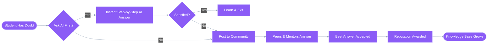
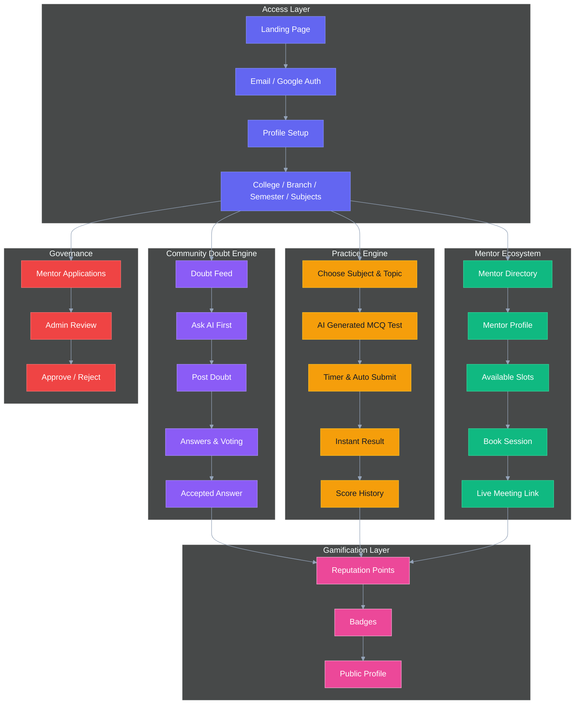
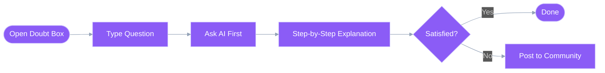
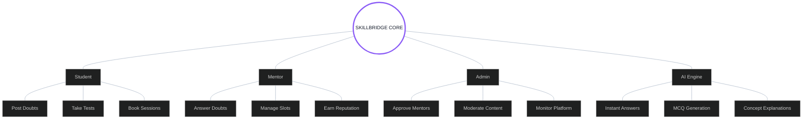

# DEV_FUSION

# 🎓 SKILLBRIDGE
### The Peer Learning & Doubt Resolution Ecosystem
**Ask. Learn. Mentor. Grow.**

---

## 🚀 Hero Banner
> **SkillBridge is a full-stack collaborative learning platform built for college students to resolve doubts faster, connect with verified mentors, attend live sessions, practice topic-wise tests, and grow through reputation-driven community learning.** It combines the speed of AI assistance with the trust of peer-to-peer learning — like a student-first Stack Overflow with live mentoring built in.

---

## ⚠️ The Problem

| Friction | Current Reality | Impact |
| :--- | :--- | :--- |
| **Scattered Doubt Solving** | Students jump between WhatsApp groups, random PDFs, YouTube videos, and friends for one answer. | Learning becomes slow, inconsistent, and frustrating. |
| **No Structured Peer Help** | Doubts are asked in informal groups with no tagging, no accepted answers, and no long-term knowledge base. | Useful answers get lost and repeated again and again. |
| **Limited Mentor Access** | Students struggle to find reliable seniors or mentors for 1:1 academic help. | Guidance remains inaccessible, especially before exams. |
| **Low Motivation to Contribute** | Most student communities lack points, badges, and visibility for helpful contributors. | Fewer students answer doubts consistently. |
| **Practice Feels Passive** | Students consume theory but rarely test themselves topic by topic. | Weak retention and poor exam readiness. |

---

## 💡 The Solution

---

## 🗺️ Platform Architecture

---

## ✨ Key Features

### ❓ Doubt Feed
| Feature | Description |
| :--- | :--- |
| **Rich Doubt Posting** | Students can post doubts with formatted text, code blocks, and images for better clarity. |
| **Academic Tagging** | Questions are categorized by subject, branch, and semester for highly relevant discovery. |
| **Answer Voting** | Upvote and downvote mechanisms help surface the most useful responses. |
| **Accepted Answer System** | One answer can be marked as accepted, rewarding the contributor and closing the loop. |
| **Smart Filters** | Filter doubts by Unanswered, Trending, My Subject, and My Branch. |

### 🤖 AI Doubt Solver
| Feature | Description |
| :--- | :--- |
| **Ask AI First** | Before posting publicly, students can get an instant AI-generated explanation. |
| **Step-by-Step Learning** | AI responds with concept breakdowns instead of only final answers. |
| **Post If Unsatisfied** | If the answer is not enough, the student can push the doubt directly to the community. |
| **Faster Resolution** | Reduces duplicate posts and gives immediate help during study sessions. |

### 🎓 Mentor System
| Feature | Description |
| :--- | :--- |
| **Mentor Applications** | Students can apply to become mentors and get approved by an admin. |
| **Live Session Scheduling** | Mentors can publish available time slots for doubt sessions. |
| **Session Booking** | Students reserve a 30-minute slot from listed availability. |
| **Meeting Integration** | Each session includes a Google Meet or Jitsi meeting link. |
| **Flexible Fees** | Mentors can set session fees from ₹0 to ₹500 with sandbox payment flow. |

### 📝 Practice Tests
| Feature | Description |
| :--- | :--- |
| **Topic-Based MCQs** | AI generates practice quizzes for selected subjects and topics. |
| **Timed Experience** | Built-in timer creates a realistic test environment. |
| **Auto Submit** | Tests submit automatically when time ends. |
| **Instant Feedback** | Students see scores and correct answers immediately. |
| **Score History** | Progress is tracked subject-wise for each user. |

### 🏆 Reputation & Gamification
| Feature | Description |
| :--- | :--- |
| **Point Economy** | Users earn points through answering, accepted solutions, logins, and tests. |
| **Achievement Badges** | Recognition badges motivate consistent contribution and learning. |
| **Public Profiles** | Users showcase reputation, badges, and answered doubts publicly. |
| **Community Trust Layer** | High-reputation members become more discoverable and respected. |

---

## 🌊 Core User Flows

### 1. 🧠 AI-First Doubt Resolution Flow

### 2. 💬 Community Answering Flow

### 3. 📅 Mentor Booking Flow

### 4. 🧪 Practice Test Flow

### 5. 🏅 Reputation Growth Flow

---

## 🎭 Multi-Role Architecture

---

## 🧩 Reputation Model

| Action | Reward |
| :--- | :--- |
| **Answering a doubt** | `+10 points` |
| **Accepted answer** | `+25 points` |
| **Daily login** | `+2 points` |
| **Practice test completion** | `+5 points` |

### 🏅 Badge System
| Badge | Unlock Condition |
| :--- | :--- |
| **First Answer** | Submit your first answer |
| **Helpful Mentor** | Get multiple accepted answers as mentor |
| **Streak Master** | Maintain consistent daily logins |
| **Subject Expert** | Earn high reputation in a specific subject |

---

## 🔔 Notification System

| Trigger | Notification |
| :--- | :--- |
| **New answer received** | "Your doubt got an answer" |
| **Session reminder** | "Your mentor session starts in 30 minutes" |
| **Accepted answer** | "Your answer was accepted" |
| **Badge unlocked** | "You earned a new badge" |
| **Test completed** | "Your test result is ready" |

---

## 🎨 Design System

| Token | Value / Sample | UI Usage |
| :--- | :--- | :--- |
| **Primary Violet** | `#8B5CF6` | Main CTAs, active tabs, AI highlights |
| **Trust Blue** | `#2563EB` | Links, badges, info states |
| **Mentor Green** | `#10B981` | Mentor approval, booking success, live session states |
| **Alert Amber** | `#F59E0B` | Timers, pending actions, reminders |
| **Typography** | `Inter / Outfit` | Modern high-readability interface |
