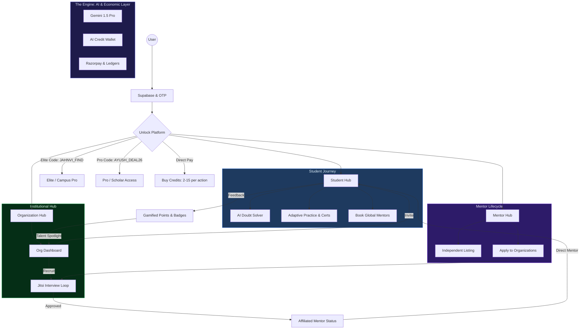

# 🌐 The Integrated SkillBridge Ecosystem: Final Vision

This is the comprehensive blueprint for the **SkillBridge** platform, representing the full integration of Students, Mentors, and Organizations within a self-sustaining AI economy.

## 🔄 The Master Integrated Workflow

---

## 🛠️ Component Breakdown

### 1. Unified Identity & Roles
- **Students**: The primary consumers who engage in the Reputation Flywheel.
- **Independent Mentors**: Standalone experts listing globally. They receive **80-90%** of their gross booking amount.
- **Organizations**: Universities or Companies that create private learning clusters.

### 2. The Interaction Loop (Affiliation)
- **Recruitment**: Independent Mentors can apply to join an Organization.
- **Interviewing**: Admins use a dedicated Dashboard to schedule and conduct **Live Jitsi Interviews**.
- **Onboarding**: Once approved, mentors are "Affiliated," granting them priority access to the organization's student population.

### 3. The Economic Core
- **Coupons**: 
    - `JAHNVI_FIND`: Unlocks 1 year of **Elite** (Campus Pro) access.
    - `AYUSH_DEAL26`: Unlocks 1 year of **Pro** access.
- **Credits**: Users can buy one-time credit packs to solve doubts (2c), generate tests (5c), or receive AI coaching (8c).
- **Ledgers**: All transactions flow through a Commission Ledger for transparent platform management and mentor payouts.

### 4. The Outcome (Legacy)
- **Certificates**: Students passing AI-proctored tests (80%+) earn verifiable QR-backed certificates.
- **Talent Discovery**: Organizations use the internal **Leaderboard** and recruitment opt-ins to hire top-performing students directly from the platform.
